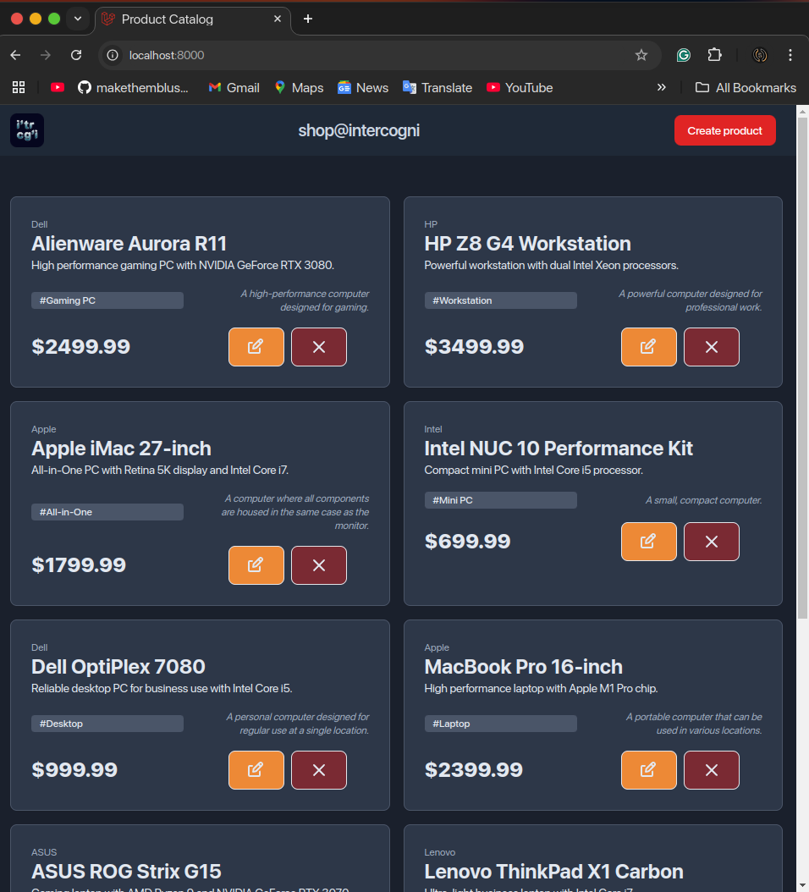
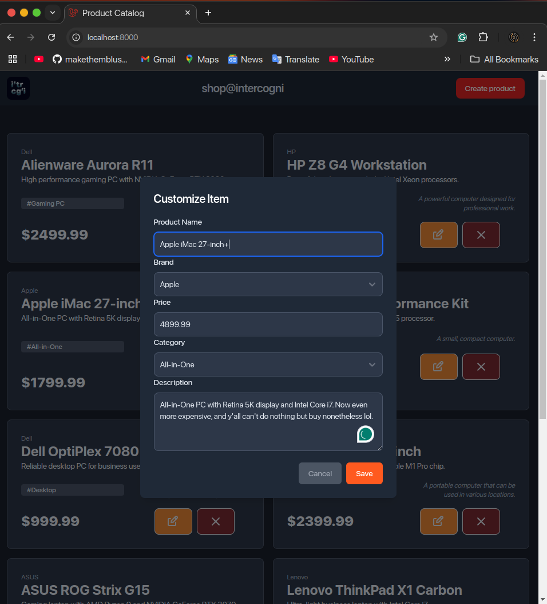
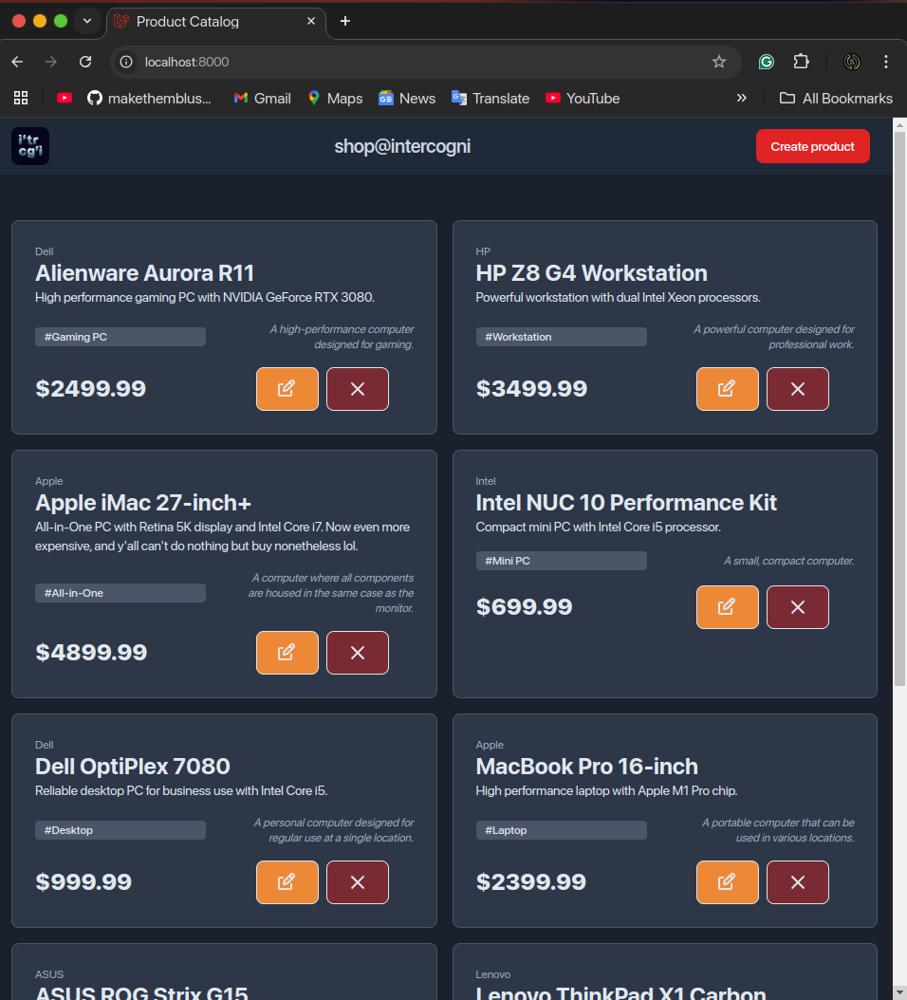
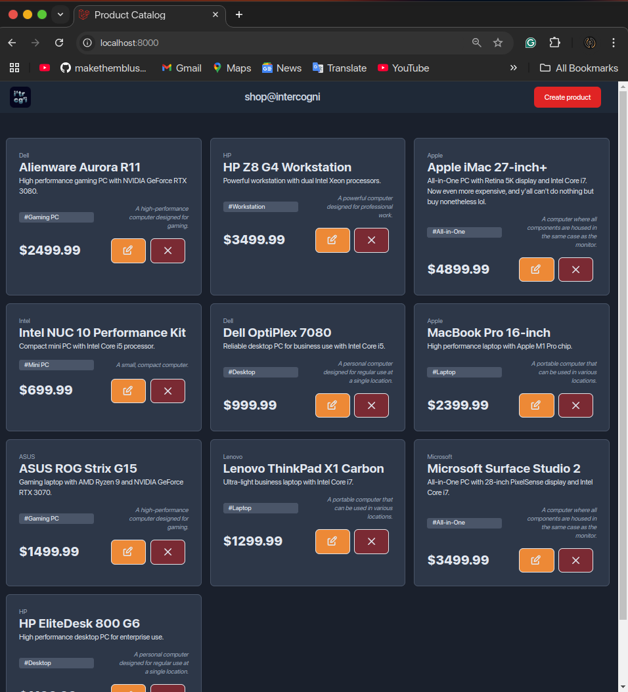
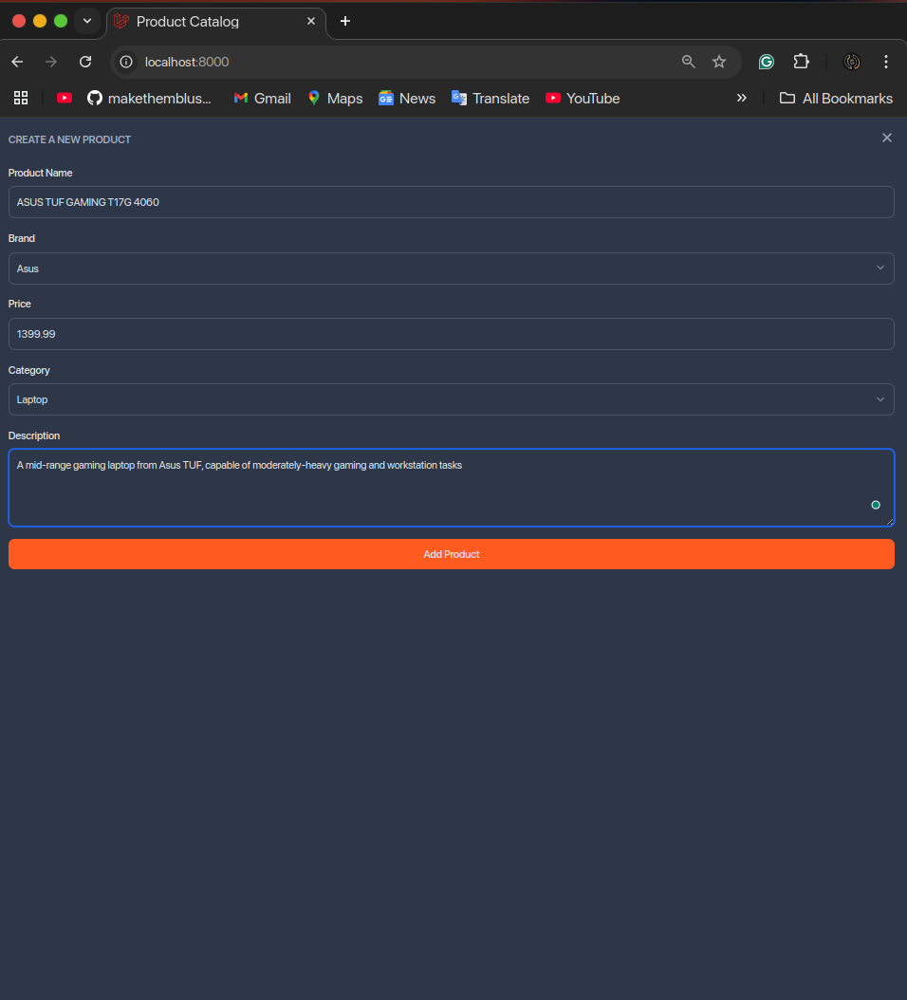
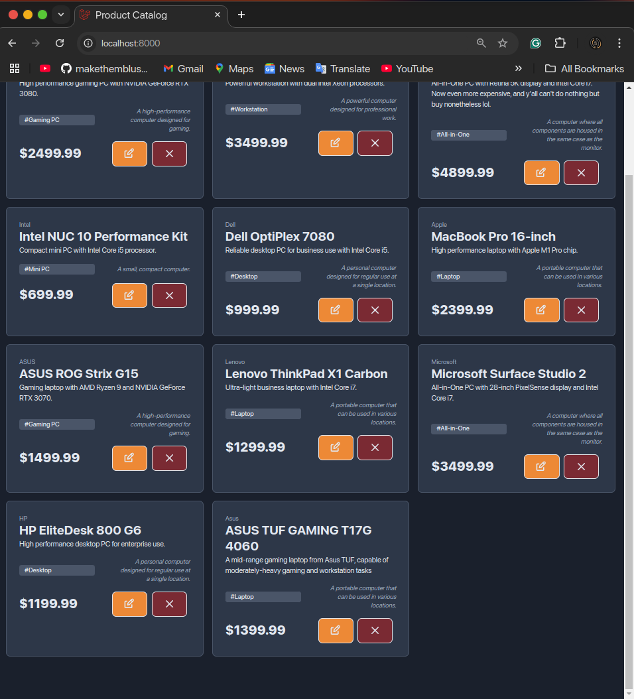
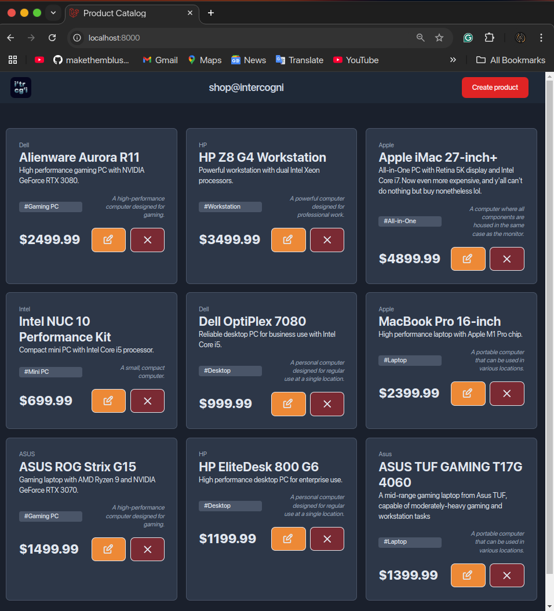

# 🌐 `shop.intercogni.com`
> `shop.intercogni.com`'s purpose is to be a website to display a catalogue of PCs to purchase on a store.

> The website is created using `Laravel`, the full-stack highly-opinionated web-programming framework.

# 📚 Table of Contents

# ✨ Features
- 🛒 **Product Catalogue**: Display a list of PCs available for purchase.
- 🖥️ **Product Details**: View detailed information about each product.
- 📱 **Responsive Design**: Optimized for both desktop and mobile devices.

# 🗂️ Database/Model Diagram


# 🎥 Demo Video

> The demo video can otherwise be accessed by downloading the file at `public/demo_video.webm`

# 📸 Screenshots

## 🏠 Main Page

> The main page of the website showcasing the product catalogue.

## ✏️ Editing

> Interface for editing the details of a product.

## ✅ After Editing

> View of the product after the details have been successfully edited.

## ➕ Before Addition

> The state of the product list before adding a new product.

## ➕ Adding

> Interface for adding a new product to the catalogue.

## ✅ After Addition

> View of the product list after a new product has been added.

## ❌ After Deletion

> The state of the product list after a product has been deleted.

# ⚙️ Installation

1. 📥 Clone the repository:
	```sh
	git clone git@github.com:oportunitas/shop.intercogni.com.git
	cd shop.intercogni.com
	```

2. 📦 Install dependencies:
	```sh
	composer install
	npm install
	```

3. 📄 Import the `.env` file, **please ask the code owner** for the `.env` file

4. 🔑 Generate the application key:
	```sh
	php artisan key:generate
	```

5. 🗄️ Run database migrations:
	```sh
	php artisan migrate
	```

6. 🛠️ Build the Vite Frontend helper through npm:
	```sh
	npm run build
	```

6. 🚀 Start the development server:
	```sh
	php artisan serve
	```

## 🌐 API Endpoints
- `POST` `/products/add`: ➕ add a product into the database
- `POST` `/products/edit`: ✏️ edit one or more properties of an existing product (id is embedded in json of request for streamlining)
- `DELETE` `/products/delete/{id}`: ❌ delete an existing product from the database