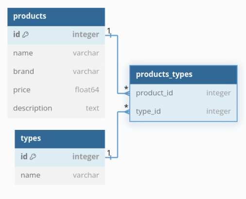

# 🌐 `shop.intercogni.com`
> `shop.intercogni.com`'s purpose is to be a website to display a catalogue of PCs to purchase on a store.

> The website is created using `Laravel`, the full-stack highly-opinionated web-programming framework.

# 📚 Table of Contents

# ✨ Features

# 🗂️ Database/Model Diagram


# 🎥 Demo Video

# 📸 Screenshots

# ⚙️ Installation

1. 📥 Clone the repository:
	```sh
	git clone git@github.com:oportunitas/shop.intercogni.com.git
	cd shop.intercogni.com
	```

2. 📦 Install dependencies:
	```sh
	composer install
	npm install
	```

3. 📄 Import the `.env` file, **please ask the code owner** for the `.env` file

4. 🔑 Generate the application key:
	```sh
	php artisan key:generate
	```

5. 🗄️ Run database migrations:
	```sh
	php artisan migrate
	```

6. 🛠️ Build the Vite Frontend helper through npm:
	```sh
	npm run build
	```

6. 🚀 Start the development server:
	```sh
	php artisan serve
	```

## 🌐 API Endpoints